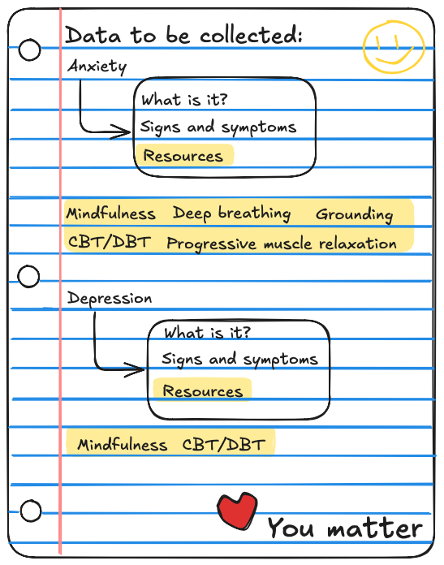

# <a name="top"></a> Table of Contents

## Overview

  - [Problem](#problem)
  - [User Profile](#user-profile)
  - [Features](#features)

## Implementation

  - [Tech Stack](#tech-stack)
  - [APIs](#apis)
  - [Endpoints](#endpoints)

## Roadmap

  - [Initial Setup](#part-1-initial-setup)
  - [Data Prep](#part-2-data-prep)
  - [Create Features](#part-3-create-features)
  - [Bug Fixes](#part-4-bug-fixes)
  - [Demo Day](#part-5-demo-day)

## Last but not least...

  - [Nice-to-haves](#nice-to-haves)

# Project Title


**MoodCompass** is a safe space where individuals can learn more about their negative emotional states, as well as relevant coping strategies and therapy options to help them.

MoodCompass is rooted in the following values:


### <a name="problem"></a>Problem

There has been a sharp decline in mental health worldwide since the COVID-19 pandemic. The increased prevalence of anxiety, depression, and stress has led to a high demand for mental health services. However, there is a well-documented shortage of such services.

Currently, there are online resources available to help users learn about their negative moods, coping strategies, and more. However, many of these apps do not allow users to save educational resources in a centralized location for easy retrieval. As a result, users often need to search for these resources repeatedly, which can be time-consuming and discouraging.

---

### <a name="user-profile"></a> User Profile

- Individuals who want to learn more about their mood(s) or mood(s) in general.

- Individuals who want to learn about the different coping strategies and therapy options relevant to negative moods.

- Individuals who want to keep track of the different educational resources they acess on MoodCompass.

---

### <a name="features"></a> Features

As a user, I want to be able to...

- Learn about the mental and physical signs and symptoms related to my negative mood.

- Learn about the relevant coping strategies to address my negative mood.

- Save different educational resources so I can easily come back to them as needed.

*[Back to the top](#top)*

---


### <a name="tech-stack"></a> Tech Stack

- React
- Node.js
- Express
- MySQL

<details>
  <summary>Client Libraries/Tools</summary>
    <ul>
      <li>SASS</li>
      <li>Material UI</li>
      <li>Axios</li>
      <li>react-router-dom</li>
      <li>react-helmet-async</li>
      <li>Firebase</li>
    </ul>
</details>

<details>
  <summary>Server Libraries/Tools</summary>
  <ul>
    <li>Express</li>
    <li>Knex</li>
    <li>Firebase</li>
  </ul>
</details>

---

### <a name="apis"></a> APIs

- No external APIs will be used for this. I will be making my own API.

---


### <a name="endpoints"></a> Endpoints

<details>
<summary>GET</summary><br>

```GET /api/moods```
- Retrieve a list of all available moods

Response body example:
```json
[
  { "id": "1", "name": "Anxiety" },
  { "id": "2", "name": "Depression" },
  { "id": "3", "name": "Stress" }
]
```

---

```GET /api/moods/:id```

- Retrieve detailed information about a specific mood, including its educational resources and coping strategies.

- Parameters:
    - ```id``` (e.g., "1" for anxiety)

Response body example:
```json
{
  "mood": {
    "id": "1",
    "name": "Anxiety",
    "description": "Anxiety is a feeling of worry, nervousness, or unease about something with an uncertain outcome.",
    "educationalResources": [
      {
        "id": "101",
        "title": "Understanding Anxiety",
        "description": "An article explaining what anxiety is, its symptoms, and potential causes.",
        "content": "Full text of the article about understanding anxiety."
      },
      {
        "id": "102",
        "title": "Managing Anxiety",
        "description": "A guide to managing anxiety through various techniques and lifestyle changes.",
        "content": "Detailed guide on techniques to manage anxiety."
      }
    ],
    "copingStrategies": [
      {
        "id": "201",
        "strategy": "Deep Breathing Exercises",
        "description": "A technique to help calm the mind and body through controlled breathing.",
        "content": "Detailed instructions on how to perform deep breathing exercises."
      },
      {
        "id": "202",
        "strategy": "Progressive Muscle Relaxation",
        "description": "A method to reduce muscle tension and anxiety.",
        "content": "Step-by-step guide to practicing progressive muscle relaxation."
      }
    ]
  }
}
```

---

```GET /api/educational/resources```

- Retrieve a list of all educational resources available.

```json
[
  {
    "id": "101",
    "title": "Understanding Anxiety",
    "description": "An article explaining what anxiety is, its symptoms, and potential causes.",
    "content": "Full text of the article about understanding anxiety."
  },
  {
    "id": "102",
    "title": "Managing Anxiety",
    "description": "A guide to managing anxiety through various techniques and lifestyle changes.",
    "content": "Detailed guide on techniques to manage anxiety."
  }
]

```

```GET /api/educational-resources/:id```

- Retrieve detailed information about a specific educational resource.

- Parameters:
    - ```id``` (e.g., 101)

Response body example:
```json
{
  "id": "101",
  "title": "Understanding Anxiety",
  "description": "An article explaining what anxiety is, its symptoms, and potential causes.",
  "content": "Full text of the article about understanding anxiety."
}
```

---

```GET /api/coping-strategies```

- Retrieve a list of all coping strategies

Response body example:
```json
[
  {
    "id": "201",
    "strategy": "Deep Breathing Exercises",
    "description": "A technique to help calm the mind and body through controlled breathing.",
    "content": "Detailed instructions on how to perform deep breathing exercises."
  },
  {
    "id": "202",
    "strategy": "Progressive Muscle Relaxation",
    "description": "A method to reduce muscle tension and anxiety.",
    "content": "Step-by-step guide to practicing progressive muscle relaxation."
  }
]
```

--- 
```GET /api/coping-strategies/:id```

- Retrieve detailed information about a specific coping strategy.

- Parameters:
    - ```id``` (e.g., 201)

Response body example:
```json
{
  "id": "201",
  "strategy": "Deep Breathing Exercises",
  "description": "A technique to help calm the mind and body through controlled breathing.",
  "content": "Detailed instructions on how to perform deep breathing exercises."
}
```

---

```GET /api/users/:id/favorites```

- Retrieve all saved items for the user

- Parameters:
    - ```id``` (user id)

Response body example:
```json
[
  {
    "id": "101",
    "type": "educational-resource",  // or "coping-strategy"
    "title": "Understanding Anxiety",  // Relevant for educational resources
    "strategy": "Deep Breathing Exercises",  // Relevant for coping strategies
    "description": "An article explaining what anxiety is.",  // Relevant for educational resources
    "content": "Full text of the article about understanding anxiety.",  // Relevant for educational resources
    "savedAt": "2024-09-09T12:00:00Z"
  },
  {
    "id": "202",
    "type": "coping-strategy",
    "strategy": "Progressive Muscle Relaxation",
    "description": "A method to reduce muscle tension and anxiety.",
    "content": "Step-by-step guide to practicing progressive muscle relaxation.",
    "savedAt": "2024-09-10T15:30:00Z"
  }
]
```
</details>

<details>
<summary>POST</summary><br>

```POST /api/users/register```

- Create a new user account

Request body example:
```json
{
  "username": "user123",
  "email": "user@example.com",
  "password": "securepassword"
}
```

Response body example:
```json
{
  "message": "User registered successfully.",
  "user": {
    "id": "123",
    "username": "user123",
    "email": "user@example.com"
  }
}
```

---

```POST /api/users/login```

- Authenticate a user and return a token

Request body example:
```json
{
  "email": "user@example.com",
  "password": "securepassword"
}
```

Response body example:
```json
{
  "message": "Login successful.",
  "token": "jwt-token-here",
  "user": {
    "id": "123",
    "username": "user123",
    "email": "user@example.com"
  }
}
```

---

```POST /api/users/:id/favorites```

- Saves a resource or coping strategy to the user's favorites

- Parameters:
    - ```id``` (user id)

Request body example:
```json
{
  "type": "educational-resource",  // or "coping-strategy"
  "itemId": "101"  // ID of the resource or strategy to be saved
}
```

Response body example:
```json
{
  "message": "Item saved successfully.",
  "savedItem": {
    "id": "101",
    "type": "educational-resource",  // or "coping-strategy"
    "title": "Understanding Anxiety",  // Relevant for educational resources
    "strategy": "Deep Breathing Exercises",  // Relevant for coping strategies
    "description": "An article explaining what anxiety is.",  // Relevant for educational resources
    "content": "Full text of the article about understanding anxiety."  // Relevant for educational resources
  }
}
```
</details>

<details>
  <summary>DELETE</summary><br>

```DELETE /api/users/:id/favorites/:itemId```

- Deletes a specific item from the user's favorites

- Parameters:
    - ```id``` (user id)
    - ```itemId``` (id of the item to be remvoed)

Request body example:
```json
{
  "type": "educational-resource"  // or "coping-strategy"
}
```

Response body example:
```json
{
  "message": "Item removed from favorites."
}
```
</details>

*[Back to the top](#top)*

---


### <a name="part-1-initial-setup"></a> Part 1: Initial Setup

<details>
<summary>Steps</summary>

  - Create repository
    - Within the root directory is:
      - Client directory
      - Server directory
  - Create relavant folders and files in client and server directory (e.g., components, styles, controllers, middlewares, etc)
  - Delete generated Vite files and folders that will not be used
  - Implement boilerplate codes
  - Create components *(informed by visual chunking)*
  - Set up BrowserRouter and routes in client
  - Set up routes and placeholder 200 responses in server
</details>

### <a name="part-2-data-prep"></a> Part 2: Data Prep

<details>
<summary>Steps</summary>

  - Create migration tables

  

  - Create seeds with sample data
</details>

### <a name="part-3-create-features"></a> Part 3: Create Features

<details>
  <summary>Steps</summary>
  
  - Feature: Home page

  - Feature: My Story page

  <details>
      <summary>Feature: Mood list</summary>

      - Implement moods list page
      - Create ```GET /api/moods```
  </details>

  <details>
      <summary>Feature: View mood</summary>

      - Implement view mood page
      - Create ```GET /api/moods/:id```
  </details>

  <details>
      <summary>Feature: Educational resource list</summary>

      - Implement educational resource list page
      - Create ```GET /api/educational-resources```
  </details>

  <details>
    <summary>Feature: View educational resource</summary>

      - Implement view educational resource page
      - Create ```GET /api/educational-resources/:id```
  </details>

  <details>
    <summary>Feature: View coping strategies</summary>

      - Implement view coping strategies page
      - Create ```GET /api/coping-strategies```
  </details>

  <details>
    <summary>Feature: View coping strategy</summary>

      - Implement view coping strategy page
      - Create ```GET /api/coping-strategies/:id```
  </details>

  <details>
    <summary>Feature: Create account</summary>

      - Implement register page and form
      - Create ```POST /users/register```
  </details>

  <details>
    <summary>Feature: Login</summary>

      - Implement login page + form
      - Create ```POST /users/login```
  </details>

  <details>
    <summary>Feature: Implement JWT tokens</summary>

      - Implement bryptjs for password hashing
  </details>

  <details>
    <summary>Feature: Add favorite</summary>

      - Implement function for a user to favorite a resource or coping strategy
      - Create ```POST /api/users/:id/favorites```
  </details>

  <details>
    <summary>Feature: View favorites</summary>

      - Implement a view favorites page
      - Create ```GET /api/users/:id/favorites```
  </details>

  <details>
    <summary>Feature: Delete favorite</summary>

      - Implement function for a user to delete an item from their favorites page
      - Create ```DELETE /api/users/:id/favorites/:itemId```
  </details>
</details>

### <a name="part-4-bug-fixes"></a> Step 4: Bug fixes

<details>
  <summary>Steps</summary>

    - Test web app links/navigation
    - Test web app functionality
    - Refactor and organize code
</details>

### <a name="part-5-demo-day"></a> Step 5: DEMO DAY

<details>
  <summary>Details</summary>

    Finally! Demo day! So excited. :D
</details>

*[Back to the top](#top)*

<a name="nice-to-haves"></a> 

Below are a few things I would like to implement in the future:
<details>
<summary>Log Out Functionality</summary>

  It makes sense for users to be able to log out if they can log in. I am hoping to implement this during my capstone, but if not I will implement it afterwards.
</details>

<details>
  <summary>Contact Page</summary>

  Although users can connect with me via socials, it would be more convenient if there is a page with a form they can use to contact me when they have questions, feedback, etc.
</details>

<details>
  <summary>Search Functionality</summary>

  It would be great if users can search for resources available. This would be useful when more content is added. It would make things more accessible as the web app grows larger.
</details>

<details>
  <summary>Share Functionality</summary>

  Mental health education and resources should be available for <i>everyone</i>. One way to spread available education and resources is to add a share button. By clicking that, users can share it with others through things such as social media, email, etc.
</details>

<details>
  <summary>Sort Functionality</summary>

  It would be useful for users to be able to sort moods and resources (alphabetically, newest to oldest, oldest to newest, etc). I would also like to add an option for users to reorganize and sort their favorites list.
</details>

<details>
  <summary>Forgot Password</summary>

  I do not want users to *ever* lose access to their saves resources. Therefore, it would be useful to have way for them to retrieve their lost password.
</details>

<details>
  <summary>Deploy on Netlify or Heroku</summary>

  I would love to deploy my web app for others to use. However, before that, I would like to gather feedback from key stakeholders within the healthcare and mental health sector. I think it would be helpful to deploy my web app and provide them with the URL so that they can review it.
</details>

<details>
  <summary>Google Maps (or another relevant API)</summary>

  I would love to add a page where users can input their location to find the closest mental health supports. I think this would be a great feature and make MoodCompass more of a "one-stop-shop" for mental health education and resources.
</details>

<details>
  <summary>Mood Tracker</summary>

  A feature where users can track their mood would be useful in establishing patterns (e.g., triggers, negative thinking, protective factors, etc). Users can also share this data with their healthcare provider.

  To encourage daily use of a mood tracker, it would be beneficial to add an incentive. For example, medals or even a game! A fun game would be growing your own garden. For example, every mood a user tracks will take care of a plant in their garden.

  However, this may be a late feature due to legislation surrounding the privacy and confidentiality of patient health information. A lot of care will need to go into implementing this.
</details>

*[Back to the top](#top)*