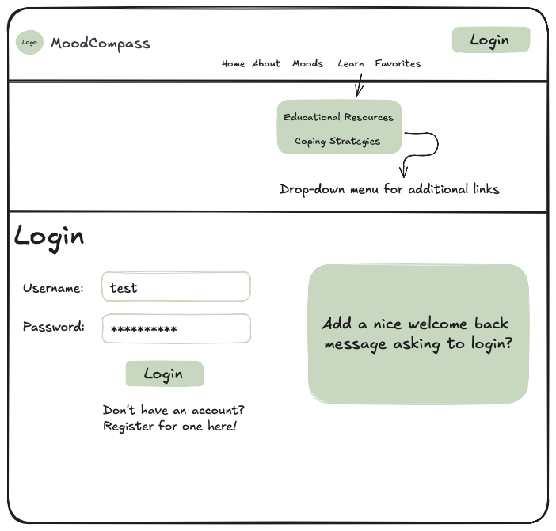

# Project Title


## Overview

**MoodCompass** is a safe space where individuals can learn more about their negative emotional states, as well as relevant coping strategies and therapy options to help them.

MoodCompass is rooted in the following values:


### Problem

There has been a sharp decline in mental health worldwide since the COVID-19 pandemic. The increased prevalence of anxiety, depression, and stress has led to a high demand for mental health services. However, there is a well-documented shortage of such services.

Currently, there are online resources available to help users learn about their negative moods, coping strategies, and more. However, many of these apps do not allow users to save educational resources in a centralized location for easy retrieval. As a result, users often need to search for these resources repeatedly, which can be time-consuming and discouraging.

### User Profile

- Individuals who want to learn more about their mood(s) or mood(s) in general.

- Individuals who want to learn about the different coping strategies and therapy options relevant to negative moods.

- Individuals who want to keep track of the different educational resources they acess on MoodCompass.

### Features

As a user, I want to be able to...

- Learn about the mental and physical signs and symptoms related to my negative mood.

- Learn about the relevant coping strategies to address my negative mood.

- Save different educational resources so I can easily come back to them as needed.

## Implementation

### Tech Stack


- React
- Express
- MySQL
- Client libraries:
    - react
    - react-router
    - axios
    - react-helmet-async
    - sass
    - joi
    - dayjs
    - react-redux
    - jest
- Server libraries:
    - Express.js
    - Knex.js
    - joi
    - bcryptjs for password hashing
    - jest
    - helmet

### APIs

- No external APIs will be used for this. I will be making my own API.

### Sitemap

- Home page
- My Story
    - A brief introduction about myself and why I wanted to create this web application.
- Education
    - Moods:
        - Anxiety
            - What is it?
            - Signs and symptoms
            - Resources
        - Depression
            - What is it?
            - Signs and symptoms
            - Resources
- Resources
    - Anxiety:
        - Mindfulness
        - Relaxation techniques
        - DBT/CBT strategies
    - Depression:
        - Therapy options
        - Self-care practices


### Mockups

Register Page:


---

Login Page:



---

Homepage (not logged in):


---

Homepage (logged in):


Note: users can freely navigate through the app without logging in. However, favoriting resources will require logging in. Once logged in, the user will see the "Favorites" link pop up in the header navigation.

The following mockups will be provided in the POV of a signed in user:

---

About Page:


---

Moods Page:


---

Anxiety Page (specific mood page):


---

Educational Resources Page:


---

Mind Connection Page (specific educational resource page):


---

Coping Strategies Page:


---

Emotion Regulation Page (specific coping strategy page):


--

Favorites Page:


**Note: The save/favorite button for each individual resource will be located either at the top or bottom of the page. Still deciding on location.**


### Data


### Endpoints

```GET /api/moods```

- Retrieve a list of all available moods.

Response body example:
```json
[
  { "id": "1", "name": "Anxiety" },
  { "id": "2", "name": "Depression" },
  { "id": "3", "name": "Stress" }
]
```

---

```GET /api/moods/:id```

- Retrieve detailed information about a specific mood, including its educational resources and coping strategies.

- Parameters:
    - ```id``` (e.g., "1" for anxiety)

Response body example:
```json
{
  "mood": {
    "id": "1",
    "name": "Anxiety",
    "description": "Anxiety is a feeling of worry, nervousness, or unease about something with an uncertain outcome.",
    "educationalResources": [
      {
        "id": "101",
        "title": "Understanding Anxiety",
        "description": "An article explaining what anxiety is, its symptoms, and potential causes.",
        "content": "Full text of the article about understanding anxiety."
      },
      {
        "id": "102",
        "title": "Managing Anxiety",
        "description": "A guide to managing anxiety through various techniques and lifestyle changes.",
        "content": "Detailed guide on techniques to manage anxiety."
      }
    ],
    "copingStrategies": [
      {
        "id": "201",
        "strategy": "Deep Breathing Exercises",
        "description": "A technique to help calm the mind and body through controlled breathing.",
        "content": "Detailed instructions on how to perform deep breathing exercises."
      },
      {
        "id": "202",
        "strategy": "Progressive Muscle Relaxation",
        "description": "A method to reduce muscle tension and anxiety.",
        "content": "Step-by-step guide to practicing progressive muscle relaxation."
      }
    ]
  }
}
```

---

```GET /api/educational-resource```

- Retrieve a list of all educational resources.

Response body example:
```json
[
  {
    "id": "101",
    "title": "Understanding Anxiety",
    "description": "An article explaining what anxiety is, its symptoms, and potential causes.",
    "content": "Full text of the article about understanding anxiety."
  },
  {
    "id": "102",
    "title": "Managing Anxiety",
    "description": "A guide to managing anxiety through various techniques and lifestyle changes.",
    "content": "Detailed guide on techniques to manage anxiety."
  }
]
```

---

```GET /api/educational-resource/:id```

- Retrieve detailed information about a specific educational resource.

- Parameters:
    - ```id``` (e.g., 101)

Response body example:
```json
{
  "id": "101",
  "title": "Understanding Anxiety",
  "description": "An article explaining what anxiety is, its symptoms, and potential causes.",
  "content": "Full text of the article about understanding anxiety."
}

```

---

```GET /api/coping-strategies```

- Retrieve a list of all coping strategies

Response body example:
```json
[
  {
    "id": "201",
    "strategy": "Deep Breathing Exercises",
    "description": "A technique to help calm the mind and body through controlled breathing.",
    "content": "Detailed instructions on how to perform deep breathing exercises."
  },
  {
    "id": "202",
    "strategy": "Progressive Muscle Relaxation",
    "description": "A method to reduce muscle tension and anxiety.",
    "content": "Step-by-step guide to practicing progressive muscle relaxation."
  }
]
```

--- 
```GET /api/coping-strategies/:id```

- Retrieve detailed information about a specific coping strategy.

- Parameters:
    - ```id``` (e.g., 201)

Response body example:
```json
{
  "id": "201",
  "strategy": "Deep Breathing Exercises",
  "description": "A technique to help calm the mind and body through controlled breathing.",
  "content": "Detailed instructions on how to perform deep breathing exercises."
}
```

--- 

```POST /api/users/register```

- Create a new user account

Request body example:
```json
{
  "username": "user123",
  "email": "user@example.com",
  "password": "securepassword"
}
```

Response body example:
```json
{
  "message": "User registered successfully.",
  "user": {
    "id": "123",
    "username": "user123",
    "email": "user@example.com"
  }
}
```

---

```POST /api/users/login```

- Authenticate a user and return a token

Request body example:
```json
{
  "email": "user@example.com",
  "password": "securepassword"
}
```

Response body example:
```json
{
  "message": "Login successful.",
  "token": "jwt-token-here",
  "user": {
    "id": "123",
    "username": "user123",
    "email": "user@example.com"
  }
}
```

---

```POST /api/users/:id/favorites```

- Saves a resource or coping strategy to the user's favorites

- Parameters:
    - ```id``` (user id)

Request body example:
```json
{
  "type": "educational-resource",  // or "coping-strategy"
  "itemId": "101"  // ID of the resource or strategy to be saved
}
```

Response body example:
```json
{
  "message": "Item saved successfully.",
  "savedItem": {
    "id": "101",
    "type": "educational-resource",  // or "coping-strategy"
    "title": "Understanding Anxiety",  // Relevant for educational resources
    "strategy": "Deep Breathing Exercises",  // Relevant for coping strategies
    "description": "An article explaining what anxiety is.",  // Relevant for educational resources
    "content": "Full text of the article about understanding anxiety."  // Relevant for educational resources
  }
}
```

---

```GET /api/users/:id/favorites```

- Retrieve all saved items for the user

- Parameters:
    - ```id``` (user id)

Response body example:
```json
[
  {
    "id": "101",
    "type": "educational-resource",  // or "coping-strategy"
    "title": "Understanding Anxiety",  // Relevant for educational resources
    "strategy": "Deep Breathing Exercises",  // Relevant for coping strategies
    "description": "An article explaining what anxiety is.",  // Relevant for educational resources
    "content": "Full text of the article about understanding anxiety.",  // Relevant for educational resources
    "savedAt": "2024-09-09T12:00:00Z"
  },
  {
    "id": "202",
    "type": "coping-strategy",
    "strategy": "Progressive Muscle Relaxation",
    "description": "A method to reduce muscle tension and anxiety.",
    "content": "Step-by-step guide to practicing progressive muscle relaxation.",
    "savedAt": "2024-09-10T15:30:00Z"
  }
]
```

---

```DELETE /api/users/:id/favorites/:itemId```

- Deletes a specific item from the user's favorites

- Parameters:
    - ```id``` (user id)
    - ```itemId``` (id of the item to be remvoed)

Request body example:
```json
{
  "type": "educational-resource"  // or "coping-strategy"
}
```

Response body example:
```json
{
  "message": "Item removed from favorites."
}
```


## Roadmap

- Create repository

- Create client
    - React project with routes and boilerplate pages
    - Update client folder structure

- Create server
    - Express project with routing and placeholder 200 responses
    - Update server folder structure

- Create migration

- Gather data for the following:

    - **Anxiety:**
        - What it is
        - Signs and symptoms
        - **Resources:**
            - Mindfulness
            - Deep breathing
            - Progressive muscle relaxation
            - Grounding
            - CBT/DBT
    - **Depression:**
        - What it is
        - Signs and symptoms
        - **Resources:**
            - Mindfulness
            - CBT/DBT

- Create seeds with sample data

- Deploy client and server projects so all commits will be reflected in production

- Feature: Home page

- Feature: My Story page

- Feature: Mood list
    - Implement moods list page
    - Create ```GET /api/moods```

- Feature: View mood
    - Implement view mood page
    - Create ```GET /api/moods/:id```

- Feature: Educational resource list
    - Implement educational resource list page
    - Create ```GET /api/educational-resources```

- Feature: View educational resource
    - Implement view educational resource page
    - Create ```GET /api/educational-resources/:id```

- Feature: View coping strategies
    - Implement view coping strategies page
    - Create ```GET /api/coping-strategies```

- Feature: View coping strategy
    - Implement view coping strategy page
    - Create ```GET /api/coping-strategies/:id```


- Feature: Create account
    - Implement register page and form
    - Create ```POST /users/register```

- Feature: Login
    - Implement login page + form
    - Create ```POST /users/login``` 

- Feature: Implement JWT tokens

- Feature: Add favorite
    - Implement function for a user to favorite a resource or coping strategy
    - Create ```POST /api/users/:id/favorites```

- Feature: View favorites
    - Implement a view favorites page
    - Create ```GET /api/users/:id/favorites```

- Feature: Delete favorite
    - Implement function for a user to delete an item from their favorites page
    - Create ```DELETE /api/users/:id/favorites/:itemId```

- Bug fixes

- DEMO DAY

## Nice-to-haves

- Integrate Google Maps (or another relevant API) to help users locate mental health supports within their radius.

- Ability for each user to track their own mood.

- Mood journal/tracker associated with each user.
    - Allows users to track their mood.
    - Helps establish a pattern that users can show their healthcare provider and/or be used to help them identify triggers and protective factors.

- Replace JWT with OAuth/SSO.