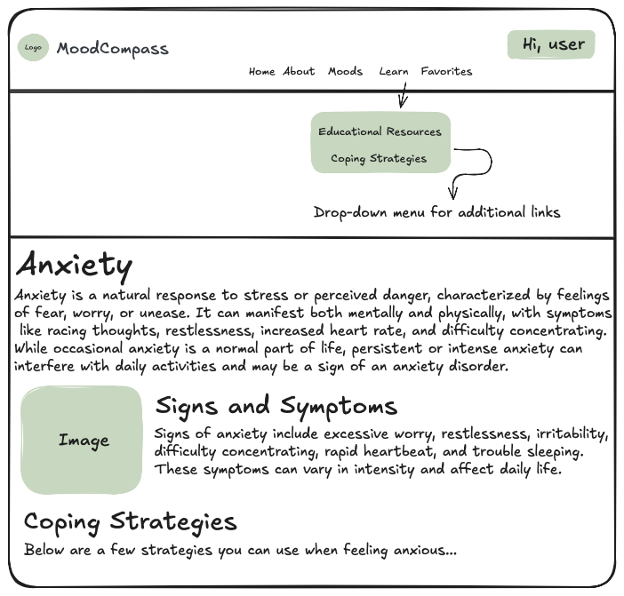

# Project Title


**MoodCompass** is a safe space where individuals can learn more about their negative emotional states, as well as relevant coping strategies and therapy options to help them.

MoodCompass is rooted in the following values:


### Problem

There has been a sharp decline in mental health worldwide since the COVID-19 pandemic. The increased prevalence of anxiety, depression, and stress has led to a high demand for mental health services. However, there is a well-documented shortage of such services.

Currently, there are online resources available to help users learn about their negative moods, coping strategies, and more. However, many of these apps do not allow users to save educational resources in a centralized location for easy retrieval. As a result, users often need to search for these resources repeatedly, which can be time-consuming and discouraging.

---

### User Profile

- Individuals who want to learn more about their mood(s) or mood(s) in general.

- Individuals who want to learn about the different coping strategies and therapy options relevant to negative moods.

- Individuals who want to keep track of the different educational resources they acess on MoodCompass.

---

### Features

As a user, I want to be able to...

- Learn about the mental and physical signs and symptoms related to my negative mood.

- Learn about the relevant coping strategies to address my negative mood.

- Save different educational resources so I can easily come back to them as needed.

---


### Tech Stack

- React
- Express
- MySQL
- Client libraries:
    - react
    - react-router
    - axios
    - react-helmet-async
    - sass
    - joi
    - dayjs
    - react-redux
    - jest
- Server libraries:
    - Express.js
    - Knex.js
    - joi
    - bcryptjs for password hashing
    - jest
    - helmet

---

### APIs

- No external APIs will be used for this. I will be making my own API.

---

### Sitemap and Mockups

<details>
<summary>Home Page</summary>


Above is an example of the homepage when a user is not logged in. Users will be able to freely navigate the web app without having an account. However, current and future features will require users to have an account.

The homepage will consist of a welcome message, as well as a space for me to put updates (e.g., new added feature). 

I also did some visual chunking for my mockup here:

<h4>Header Component:</h4>
  <details>
    <ul>
      <li>MoodCompass logo</li>
      <li>Navigation bar</li>
        <ul>
          <li>A dropdown menu with links will appear when a user hovers over "Learn".</li>
        </ul>
      <li>Login button</li>
    </ul>
    </details>

<h4>Hero Component:</h4>
  <details>
    <ul>
      <li>Hero image</li>
      <li>MoodCompass catchline</li>
    </ul>
  </details>

<h4>Footer Component:</h4>
  <details>
    <ul>
      <li>Connect</li>
        <ul>
          <li>I will provide ways for users to connect with me.</li>
        </ul>
      <li>MoodCompass logo</li>
    </ul>
  </details>

<h4>Main Body/Content:</h4>
<details>
  This is where the content of each page will be rendered.
</details>

---


This is an example of what the homepage would look like when a user is signed in. The login button will now say **"Hi, user"**, and the **"Favorites"** link will appear. This feature is only available for users.
</details>

<details>
<summary>About Page</summary>


This page will provide more information on MoodCompass, such as why it was created, its purpose, values, etc. I will also provide a blurb about myself as well to connect with my users.
</details>

<details>
<summary>Moods Page</summary>


This page will list cards of different moods that users can click to learn more about. For this capstone, I will be working with two moods. I plan on adding more in the future.

<h4>Specific Mood Page Example</h4>

</details>

<details>
<summary>Learn Page</summary>

Currently there isn't a "Learn" page since it is a hoverable dropdown menu. This dropdown menu will provide links to two pages: educational resources and coping strategies.

Although not depicted in the mockups, I plan on adding a favorite button or icon on each resource page. Favoriting a resource will add it to a user's favorites list. A modal prompting user registration will be activated if a user attempts to favorite a resource without an account.

<h4>Educational Resources Page</h4>


This page display educational resources as cards. The educational resources will provide more information on negative emotional states, as well as health promotion education. Users can click on the card to be redirected to the resource.

<h5>Specific Educational Resource Page</h5>


<h4>Coping Strategies Page</h4>


This page is similar to the educational resource page, but its content differs. Here, users can click on a card to learn more about different coping strategies.

<h5>Specific Coping Strategies Page</h5>

</details>

<details>
<summary>Favorites Page</summary>


This page is only accessible to users who are registered and signed it, and therefore will be conditionally rendered. 

This page provides a centralized location for users to revisit to find the list of resources they saved on their account.

Users will have the ability to unfavorite (delete) resources.
</details>

<details>
<summary>Register Page</summary>


This is a simple page for users to register for an account. In order to register, users will have to complete the form by filling out the username, email, and password input fields.

I am currently undecided on what I want to place on the right. Below are my current ideas for that space:

<ul>
 <li>Image</li>
 <li>Quote</li>
 <li>A blurb about the features users will have access to with an account, <i>albeit it is not a lot at the moment.</i>
</ul>

If I use an image or quote, I would like it to be something empowering.
</details>

<details>
<summary>Login Page</summary>


This page will allow users to log into the web app with their username and password. Below the login button is an option for users to register for an account if they do not have one yet.

I wanted to keep the register and login page similar. However, the login page will have some kind of welcome back message to the right of the login form.
</details>

---

### Data


---

### Endpoints

<details>
<summary>GET</summary><br>

```GET /api/moods```
- Retrieve a list of all available moods

Response body example:
```json
[
  { "id": "1", "name": "Anxiety" },
  { "id": "2", "name": "Depression" },
  { "id": "3", "name": "Stress" }
]
```

---

```GET /api/moods/:id```

- Retrieve detailed information about a specific mood, including its educational resources and coping strategies.

- Parameters:
    - ```id``` (e.g., "1" for anxiety)

Response body example:
```json
{
  "mood": {
    "id": "1",
    "name": "Anxiety",
    "description": "Anxiety is a feeling of worry, nervousness, or unease about something with an uncertain outcome.",
    "educationalResources": [
      {
        "id": "101",
        "title": "Understanding Anxiety",
        "description": "An article explaining what anxiety is, its symptoms, and potential causes.",
        "content": "Full text of the article about understanding anxiety."
      },
      {
        "id": "102",
        "title": "Managing Anxiety",
        "description": "A guide to managing anxiety through various techniques and lifestyle changes.",
        "content": "Detailed guide on techniques to manage anxiety."
      }
    ],
    "copingStrategies": [
      {
        "id": "201",
        "strategy": "Deep Breathing Exercises",
        "description": "A technique to help calm the mind and body through controlled breathing.",
        "content": "Detailed instructions on how to perform deep breathing exercises."
      },
      {
        "id": "202",
        "strategy": "Progressive Muscle Relaxation",
        "description": "A method to reduce muscle tension and anxiety.",
        "content": "Step-by-step guide to practicing progressive muscle relaxation."
      }
    ]
  }
}
```

---

```GET /api/educational/resources```

- Retrieve a list of all educational resources available.

```json
[
  {
    "id": "101",
    "title": "Understanding Anxiety",
    "description": "An article explaining what anxiety is, its symptoms, and potential causes.",
    "content": "Full text of the article about understanding anxiety."
  },
  {
    "id": "102",
    "title": "Managing Anxiety",
    "description": "A guide to managing anxiety through various techniques and lifestyle changes.",
    "content": "Detailed guide on techniques to manage anxiety."
  }
]

```

```GET /api/educational-resources/:id```

- Retrieve detailed information about a specific educational resource.

- Parameters:
    - ```id``` (e.g., 101)

Response body example:
```json
{
  "id": "101",
  "title": "Understanding Anxiety",
  "description": "An article explaining what anxiety is, its symptoms, and potential causes.",
  "content": "Full text of the article about understanding anxiety."
}
```

---

```GET /api/coping-strategies```

- Retrieve a list of all coping strategies

Response body example:
```json
[
  {
    "id": "201",
    "strategy": "Deep Breathing Exercises",
    "description": "A technique to help calm the mind and body through controlled breathing.",
    "content": "Detailed instructions on how to perform deep breathing exercises."
  },
  {
    "id": "202",
    "strategy": "Progressive Muscle Relaxation",
    "description": "A method to reduce muscle tension and anxiety.",
    "content": "Step-by-step guide to practicing progressive muscle relaxation."
  }
]
```

--- 
```GET /api/coping-strategies/:id```

- Retrieve detailed information about a specific coping strategy.

- Parameters:
    - ```id``` (e.g., 201)

Response body example:
```json
{
  "id": "201",
  "strategy": "Deep Breathing Exercises",
  "description": "A technique to help calm the mind and body through controlled breathing.",
  "content": "Detailed instructions on how to perform deep breathing exercises."
}
```

---

```GET /api/users/:id/favorites```

- Retrieve all saved items for the user

- Parameters:
    - ```id``` (user id)

Response body example:
```json
[
  {
    "id": "101",
    "type": "educational-resource",  // or "coping-strategy"
    "title": "Understanding Anxiety",  // Relevant for educational resources
    "strategy": "Deep Breathing Exercises",  // Relevant for coping strategies
    "description": "An article explaining what anxiety is.",  // Relevant for educational resources
    "content": "Full text of the article about understanding anxiety.",  // Relevant for educational resources
    "savedAt": "2024-09-09T12:00:00Z"
  },
  {
    "id": "202",
    "type": "coping-strategy",
    "strategy": "Progressive Muscle Relaxation",
    "description": "A method to reduce muscle tension and anxiety.",
    "content": "Step-by-step guide to practicing progressive muscle relaxation.",
    "savedAt": "2024-09-10T15:30:00Z"
  }
]
```
</details>

<details>
<summary>POST</summary><br>

```POST /api/users/register```

- Create a new user account

Request body example:
```json
{
  "username": "user123",
  "email": "user@example.com",
  "password": "securepassword"
}
```

Response body example:
```json
{
  "message": "User registered successfully.",
  "user": {
    "id": "123",
    "username": "user123",
    "email": "user@example.com"
  }
}
```

---

```POST /api/users/login```

- Authenticate a user and return a token

Request body example:
```json
{
  "email": "user@example.com",
  "password": "securepassword"
}
```

Response body example:
```json
{
  "message": "Login successful.",
  "token": "jwt-token-here",
  "user": {
    "id": "123",
    "username": "user123",
    "email": "user@example.com"
  }
}
```

---

```POST /api/users/:id/favorites```

- Saves a resource or coping strategy to the user's favorites

- Parameters:
    - ```id``` (user id)

Request body example:
```json
{
  "type": "educational-resource",  // or "coping-strategy"
  "itemId": "101"  // ID of the resource or strategy to be saved
}
```

Response body example:
```json
{
  "message": "Item saved successfully.",
  "savedItem": {
    "id": "101",
    "type": "educational-resource",  // or "coping-strategy"
    "title": "Understanding Anxiety",  // Relevant for educational resources
    "strategy": "Deep Breathing Exercises",  // Relevant for coping strategies
    "description": "An article explaining what anxiety is.",  // Relevant for educational resources
    "content": "Full text of the article about understanding anxiety."  // Relevant for educational resources
  }
}
```
</details>

<details>
  <summary>DELETE</summary><br>

```DELETE /api/users/:id/favorites/:itemId```

- Deletes a specific item from the user's favorites

- Parameters:
    - ```id``` (user id)
    - ```itemId``` (id of the item to be remvoed)

Request body example:
```json
{
  "type": "educational-resource"  // or "coping-strategy"
}
```

Response body example:
```json
{
  "message": "Item removed from favorites."
}
```
</summary>


- Create repository

- Create client
    - React project with routes and boilerplate pages
    - Update client folder structure

- Create server
    - Express project with routing and placeholder 200 responses
    - Update server folder structure

- Create migration

- Gather data for the following:

    - **Anxiety:**
        - What it is
        - Signs and symptoms
        - **Resources:**
            - Mindfulness
            - Deep breathing
            - Progressive muscle relaxation
            - Grounding
            - CBT/DBT
    - **Depression:**
        - What it is
        - Signs and symptoms
        - **Resources:**
            - Mindfulness
            - CBT/DBT

- Create seeds with sample data

- Deploy client and server projects so all commits will be reflected in production

- Feature: Home page

- Feature: My Story page

- Feature: Mood list
    - Implement moods list page
    - Create ```GET /api/moods```

- Feature: View mood
    - Implement view mood page
    - Create ```GET /api/moods/:id```

- Feature: Educational resource list
    - Implement educational resource list page
    - Create ```GET /api/educational-resources```

- Feature: View educational resource
    - Implement view educational resource page
    - Create ```GET /api/educational-resources/:id```

- Feature: View coping strategies
    - Implement view coping strategies page
    - Create ```GET /api/coping-strategies```

- Feature: View coping strategy
    - Implement view coping strategy page
    - Create ```GET /api/coping-strategies/:id```


- Feature: Create account
    - Implement register page and form
    - Create ```POST /users/register```

- Feature: Login
    - Implement login page + form
    - Create ```POST /users/login``` 

- Feature: Implement JWT tokens

- Feature: Add favorite
    - Implement function for a user to favorite a resource or coping strategy
    - Create ```POST /api/users/:id/favorites```

- Feature: View favorites
    - Implement a view favorites page
    - Create ```GET /api/users/:id/favorites```

- Feature: Delete favorite
    - Implement function for a user to delete an item from their favorites page
    - Create ```DELETE /api/users/:id/favorites/:itemId```

- Bug fixes

- DEMO DAY


- Integrate Google Maps (or another relevant API) to help users locate mental health supports within their radius.

- Ability for each user to track their own mood.

- Mood journal/tracker associated with each user.
    - Allows users to track their mood.
    - Helps establish a pattern that users can show their healthcare provider and/or be used to help them identify triggers and protective factors.

- Replace JWT with OAuth/SSO.