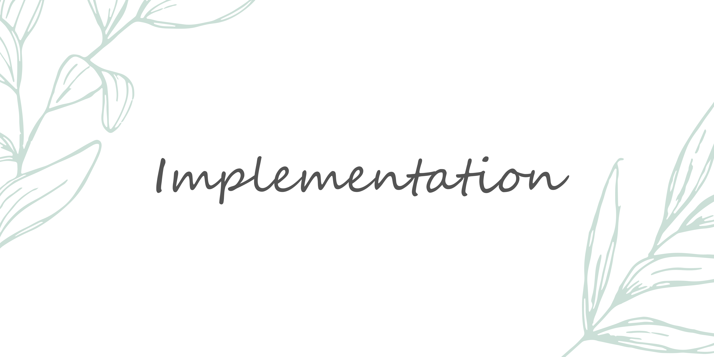

<h1 align="center">
  <strong>MoodCompass</strong> is now live! You can check it out <a href="https://mood-compass.vercel.app">here</a>. 
</h1>

There has been a sharp decline in mental health worldwide since the COVID-19 pandemic. The increased prevalence of anxiety, depression, and stress has led to a high demand for mental health services. However, there is a well-documented shortage of such services.

Currently, there are online resources available to help users learn about their negative moods, coping strategies, and more. However, many of these apps do not allow users to save educational resources in a centralized location for easy retrieval. As a result, users often need to search for these resources repeatedly, which can be time-consuming and discouraging.

That's where **MoodCompass** comes in. MoodCompass is a safe space where individuals can learn more about their negative emotional states, as well as relevant coping strategies and therapy options to help them.

**Features include:**

<ul>
  <li> <strong>User Authentication & Authorization:</strong> Secure login and logout functionality, ensuring users can access personalized content.</li>
  <li> <strong>Favorite Resources:</strong> Users can easily mark resources as favorites and remove them from favorites at any time.</li>
  <li> <strong>Persistent Data Storage:</strong> All user data, including favorites, is stored in a database, ensuring it's available across sessions.</li>
  <li> <strong>Fully Responsive Design:</strong> The application is optimized for a seamless user experience across all devices, from desktop to mobile.</li>
</ul>

**Current Updates:**

<blockquote>
  <strong>December 14, 2024:</strong>
    

      Initially, I planned to include a mood tracker/log as part of MoodCompass. However, I decided this feature would fit better within my other project, Koru, an online gratitude journal. Incorporating a daily mood prompt alongside reflective prompts feels more cohesive for Koru's purpose. As a result, MoodCompass will focus exclusively on providing mental health resources and education.
    

    

      So, what’s next for MoodCompass? My plans include adding more resources and features for users, such as search and sharing capabilities. I’m also eager to revamp the entire front-end. Over the past three months, I’ve grown significantly as a developer, and I’m excited to give MoodCompass the refresh it deserves. 😊
    

    

      For now, my primary focus is on completing Koru. Once that's done, I’ll return to MoodCompass to enhance its features and redesign its interface. Stay tuned!
    

  <strong>October 10, 2024:</strong>
    <ul>
      <li> Created migration table on database and seed files for mood options</li>
      <li> Set up test endpoints for mood options</li>
      <li> Create modal for mood options selection</li>
    </ul>
</blockquote>

Finally, MoodCompass is rooted in the following values:

---

### Tech Stack

- React
- Node.js
- Express
- MySQL

  
Client Libraries/Tools

    <ul>
      <li>SASS</li>
      <li>Material UI</li>
      <li>Axios</li>
      <li>react-router-dom</li>
      <li>react-helmet-async</li>
      <li>Firebase</li>
    </ul>

  
Server Libraries/Tools

  <ul>
    <li>Express</li>
    <li>Knex</li>
    <li>Firebase</li>
  </ul>

---

### APIs

- No external APIs will be used for this. I will be making my own API.

---

### Endpoints

**To be updated.**